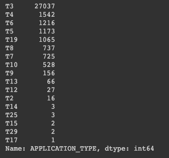

# Charity Funding Predictor

A deep learning neural network model was developed to predict the success of funded project based on historical data. A csv file containing the data of past applicants was provided. The data was imported to Google Colab to use the neural network models in latest version of tensor flow. A snapshot of the data is shown in the image below.

### Preprocessing

The data consisit of 4 features (EIN, STATUS, ASK_AMT, IS_SUCCESSFUL) with numerical data and the remaining features are categorical. The features EIN and NAME were dropped from the data as they should not influence the outcome (IS_SUCCESSFUL) of the funding. After dropping the features, the final data considered for the analysis is shown below.

The above data needs to be converted to numerical data for fitting the neural network model. Before using one hot encoding to transform the data, the number of unique values in the categorical columns are determined using pandas `nunique()`. The result is shown below.

From the above, it can be seen that categorical features APPLICATION_TYPE and CLASSIFICATION have ~90 unique values which can make the number of features large after one hot encoding. To reduce the dimensionality, the number of unique values was reduced based on `value_counts()`. Following is a summary of the value counts for APPLICATION_TYPE.

